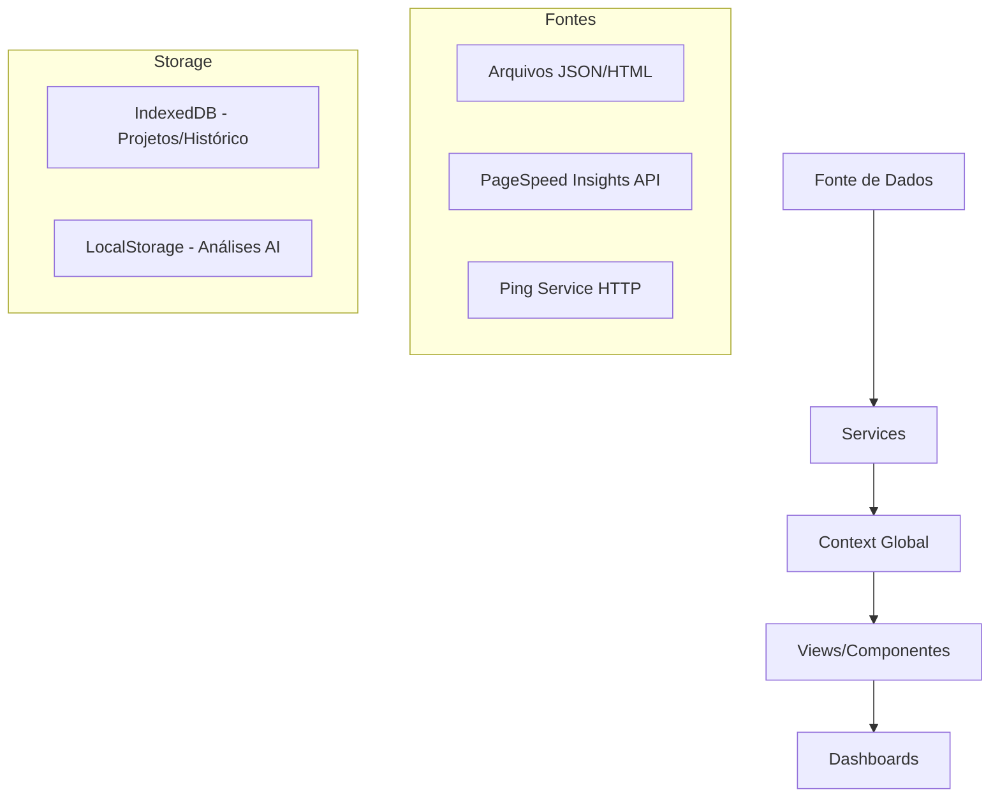
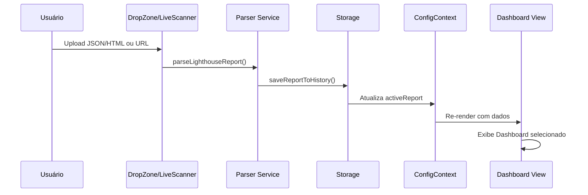

# Farol Insight - Dashboard Technical Reference

> Referência técnica completa do dashboard de análise de performance Lighthouse.

---

## 1. Visão Geral da Arquitetura

O Farol Insight é uma aplicação React/TypeScript que **analisa relatórios Lighthouse** e monitora a performance de sites. A arquitetura segue o padrão:



---

## 2. Navegação e Telas Principais

A sidebar (`Sidebar.tsx`) define as seguintes rotas (tipo `ViewType`):

| ID | Nome | Descrição | Requer Relatório |
|---|---|---|---|
| `home` | Home | Tela inicial com histórico agrupado por site | Não |
| `new` | Novo | Tela para importar/escanear novo relatório | Não |
| `sites` | Sites | Lista de projetos salvos | Não |
| `monitor` | Monitor | Monitoramento de uptime e GitHub | Não |
| `dashboard` | Dashboard | Visualização principal de métricas | **Sim** |
| `data` | Dados | Gráficos detalhados de métricas | **Sim** |
| `deep-dive` | Deep Dive | Análise avançada (opcional) | **Sim** |
| `comparison` | Comparação | Comparar múltiplos relatórios | **Sim** |
| `insights` | Insights | Análise por IA (Gemini) | **Sim** |
| `settings` | Configurações | API keys, temas, acessibilidade | Não |

---

## 3. Descrição das Telas

### 3.1 HomeScreen (`HomeScreen.tsx`)

**Propósito**: Tela inicial que exibe o histórico de análises agrupado por domínio.

**Elementos Visuais**:
- Cards de sites com score médio de performance
- Lista de relatórios recentes por site
- Botões para rescan via PSI, sincronizar pasta, excluir

**Obtenção de Dados**:
```typescript
// Carrega histórico do IndexedDB
const history = await getHistory(); // services/storage.ts

// Agrupa por URL normalizada
const grouped = history.reduce((acc, report) => {
  const normalized = normalizeUrl(report.finalUrl);
  // ...
});
```

**Separação de Dados**:
- Agrupa por `normalizeUrl()` (remove protocolo, www, trailing slash)
- Ordena por `lastAccess` descendente
- Calcula score médio do grupo

---

### 3.2 SitesView (`SitesView.tsx`)

**Propósito**: Gerenciamento de projetos salvos localmente.

**Elementos Visuais**:
- Lista de projetos com nome, URL e status do folder
- Botões para alterar pasta, editar nome, excluir projeto

**Obtenção de Dados**:
```typescript
// Obtido via ConfigContext
const { projects, updateProjectFolder, removeProject } = useConfig();
```

**Separação de Dados**:
- `projects: Project[]` - Lista de projetos
- Cada projeto tem: `id`, `name`, `url`, `handle`, `githubUrl`

---

### 3.3 MonitorView (`MonitorView.tsx`)

**Propósito**: Monitoramento em tempo real de disponibilidade (uptime) e integração GitHub.

**Elementos Visuais**:
- Tabela de status dos sites (online/slow/offline)
- Latência média e percentual de uptime
- Últimos commits e workflows do GitHub
- Histórico de pings com gráfico

**Obtenção de Dados**:
```typescript
// Ping HTTP service
import { pingSite, calculateUptime, calculateAverageLatency } from '../services/pingService';

// GitHub API
import { fetchRepoStatus, parseGitHubUrl } from '../services/githubService';
```

**Fluxo de Monitoramento**:
1. Intervalo de `PING_INTERVAL_MS` (5 minutos)
2. `pingSite(url)` faz HEAD request
3. Mede latência e classifica: `online` (<200ms), `slow` (<1000ms), `offline`
4. Salva `PingRecord` no histórico local

**Tipos Principais**:
```typescript
interface SiteStatus {
  siteId: string;
  siteName: string;
  siteUrl: string;
  currentStatus: 'online' | 'slow' | 'offline' | 'unknown';
  lastLatencyMs: number | null;
  avgLatencyMs: number | null;
  uptimePercent: number;
  pingHistory: PingRecord[];
}

interface GitHubRepoStatus {
  owner: string;
  repo: string;
  commits: GitHubCommit[];
  latestWorkflow: GitHubWorkflowRun | null;
}
```

---

### 3.4 SettingsView (`SettingsView.tsx`)

**Propósito**: Configuração de API keys, temas e preferências.

**Seções**:

| Aba | Configurações |
|---|---|
| **API Keys** | PageSpeed Insights Key, Gemini API Key, GitHub Token |
| **Aparência** | Theme Preset, Theme Mode (light/dark/system), Dashboard Layout |
| **Acessibilidade** | Color Blindness Mode, Font Scale |
| **Background** | Tipo (solid/gradient/aurora/orbital/image), Blur, Opacidade |
| **Avançado** | Advanced Mode toggle, Deep Dive toggle |

**Validação de Keys**:
```typescript
validatePsiKey()   // Testa com request real à API
validateGeminiKey() // Valida via @google/genai SDK
validateGithubToken() // Verifica /user endpoint
```

---

## 4. Layouts de Dashboard (`Dashboards.tsx`)

Quando um relatório está ativo, quatro layouts estão disponíveis:

### 4.1 MainDashboard (`main-dash`)

**Design**: Estilo "Fintech" moderno com glassmorphism.

**Componentes**:
- **Header**: URL, modo, filtros (Mode: navigation/snapshot, FormFactor: mobile/desktop)
- **Progress Bar**: Score de performance visual
- **Score Cards**: Performance, Accessibility, Best Practices, SEO
- **Performance Trend Chart**: Gráfico de linha temporal
- **Opportunities Panel**: Time/byte savings estimados
- **Advanced Metrics** (condicional): WCAG level, TBT, TTI
- **Core Vitals**: LCP, CLS, FCP com barras de progresso
- **Audit List**: Lista de auditorias reprovadas

### 4.2 BigScreenDashboard (`big-screen`)

**Design**: Otimizado para monitores 16:9 / TV.

**Layout Grid 12 colunas**:
- Coluna 3: Score global, lista de métricas
- Coluna 9: Header, Radar Chart, Trend Chart, Audit List

### 4.3 CompactDashboard (`compact-vision`)

**Design**: Visão densa/minimalista.

**Componentes**:
- Header compacto
- Grid 2x2 de scores
- Tabela de métricas
- Top 5 auditorias

### 4.4 HoustonDashboard (`houston-dash`)

**Design**: Estilo "Mission Control" / telemetria.

**Componentes**:
- Barra de status com versão e timestamp
- Grid 4 colunas de scores (estilo terminal)
- Trajectory chart (trend)
- System status com barras de progresso
- Anomaly log (audit list)

---

## 5. Serviços de Dados

### 5.1 Parser Service (`services/parser.ts`)

**Função Principal**: `parseLighthouseReport(json, source)`

**Entrada**: JSON do Lighthouse (CLI ou PSI API)

**Saída**: Objeto `LighthouseData` normalizado:

```typescript
interface LighthouseData {
  id: string;
  source: 'lighthouse' | 'psi';
  fetchTime: string;
  finalUrl: string;
  formFactor: FormFactor;       // mobile | desktop
  mode: ReportMode;              // navigation | snapshot | timespan
  lighthouseVersion: string;
  screenshot?: string;
  scores: {
    performance: number | null;
    accessibility: number | null;
    bestPractices: number | null;
    seo: number | null;
  };
  metrics: {
    lcp: Metric;   // Largest Contentful Paint
    cls: Metric;   // Cumulative Layout Shift
    fcp: Metric;   // First Contentful Paint
    inp: Metric;   // Interaction to Next Paint (ou TBT fallback)
    tti: Metric;   // Time to Interactive
    si: Metric;    // Speed Index
  };
  audits: {
    failed: Audit[];
    passed: Audit[];
    notApplicable: Audit[];
  };
  stats: {
    totalWeight: number;
    requestCount: number;
  };
  aiAnalysis?: AiResult;
  raw: any;
}
```

### 5.2 PSI Service (`services/psi.ts`)

**Função**: `runPsiAudit(url, strategy, apiKey?)`

**Fluxo**:
1. Constrói URL da API: `googleapis.com/pagespeedonline/v5/runPagespeed`
2. Parâmetros: `url`, `strategy` (mobile/desktop), `category[]`
3. Extrai `lighthouseResult` da resposta
4. Passa para `parseLighthouseReport(json, 'psi')`

### 5.3 Storage Service (`services/storage.ts`)

**IndexedDB (farol_db)**:

| Store | Descrição | Key |
|---|---|---|
| `projects` | Metadados de projetos | `id` (keyPath) |
| `handles` | FileSystemDirectoryHandle | projectId |
| `report_history` | Relatórios Lighthouse | `id` (keyPath) |

**LocalStorage**:
- `farol_analysis_{key}`: Resultados de análise AI cacheados

**Funções Principais**:
```typescript
saveReportToHistory(report)
getHistory(): Promise<LighthouseData[]>
saveProject(project)
getProjects(): Promise<Project[]>
getProjectHandle(projectId)
```

### 5.4 Ping Service (`services/pingService.ts`)

**Função**: `pingSite(url)`

**Estratégia**:
1. Tenta `HEAD` request com CORS
2. Fallback para `GET` no-cors
3. Mede `performance.now()` delta

**Thresholds**:
```typescript
const PING_THRESHOLDS = {
  GOOD: 200,      // < 200ms = online
  SLOW: 1000,     // 200-1000ms = slow
  TIMEOUT: 5000,  // > 5s = offline
};
```

---

## 6. Contexto Global (`ConfigContext.tsx`)

O `ConfigProvider` centraliza:

| Categoria | Estados |
|---|---|
| **Localização** | `language`, `t()` |
| **API Keys** | `apiKey` (PSI), `geminiApiKey`, `githubToken` |
| **Aparência** | `themePreset`, `themeMode`, `dashboardLayout`, `fontScale`, `colorBlindnessMode`, `backgroundConfig` |
| **Projetos** | `projects`, `activeProject`, `addProject()`, `removeProject()` |
| **Features** | `advancedMode`, `deepDiveEnabled`, `autoHideSidebar` |

---

## 7. Componentes de Visualização

### 7.1 Charts (`Charts.tsx`)

| Componente | Tipo | Dados |
|---|---|---|
| `PerformanceTrendChart` | LineChart (Recharts) | `reports[]` → score temporal |
| `MetricsTrendChart` | LineChart | LCP/CLS/TTI por tempo |
| `CategoryRadarChart` | RadarChart | 4 categorias em radar |

### 7.2 ScoreCard (`ScoreCard.tsx`)

Card individual com:
- Título da categoria
- Score circular colorizado (0-100)
- Indicador de status (pass/warn/fail)

### 7.3 AuditList (`AuditList.tsx`)

Lista expansível de auditorias com:
- Score badge
- Título e descrição
- Display value
- Detalhes expandíveis

---

## 8. Fluxo de Dados Completo



---

## 9. Configuração de API Keys

| Serviço | Onde Obter | Uso |
|---|---|---|
| **PageSpeed Insights** | Google Cloud Console → APIs → Enable PageSpeed Insights API | Scans live sem limite de quota |
| **Gemini AI** | Google AI Studio → API Keys | Análise inteligente de oportunidades |
| **GitHub Token** | GitHub → Settings → Developer settings → Personal access tokens | Monitor de commits/workflows |

---

## 10. Resumo de Capacidades de Monitoramento

| Recurso | Fonte | Armazenamento | Visualização |
|---|---|---|---|
| Performance Scores | Lighthouse JSON/PSI | IndexedDB | ScoreCards, Charts |
| Core Web Vitals | Lighthouse Audits | IndexedDB | Metrics Panel |
| Uptime/Latência | Ping Service HTTP | Memória (sessão) | MonitorView |
| GitHub Status | GitHub API | Memória (refresh) | MonitorView |
| Histórico Temporal | Report Collection | IndexedDB | TrendCharts |
| Análise AI | Gemini API | LocalStorage | InsightsView |

---

*Documento gerado em: 17/12/2024*  
*Versão da aplicação: Farol Insight v1.x*
