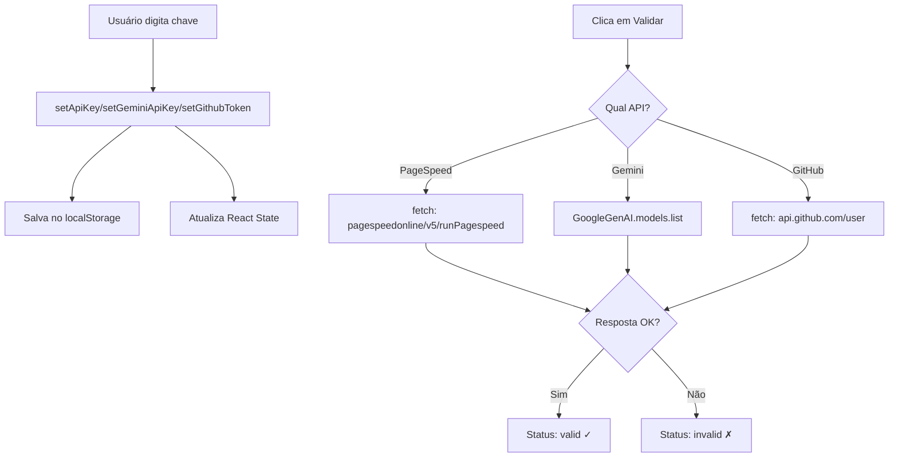

# Guia Técnico: Integração de API Keys no Farol Insight

Este documento detalha **exatamente** como as API keys funcionam no sistema, incluindo validação, persistência e uso.

---

## 📁 Arquivos Envolvidos

| Arquivo | Responsabilidade |
|---------|------------------|
| [ConfigContext.tsx](file:///c:/Users/mafhp/Documents/GitHub/farol-insight/src/contexts/ConfigContext.tsx) | **Persistência** - salva/lê chaves do localStorage |
| [SettingsView.tsx](file:///c:/Users/mafhp/Documents/GitHub/farol-insight/src/components/SettingsView.tsx) | **Validação** - funções que testam se as chaves funcionam |
| [psi.ts](file:///c:/Users/mafhp/Documents/GitHub/farol-insight/src/services/psi.ts) | **Uso** - faz requisições à API do PageSpeed Insights |

---

## 🔐 1. Persistência das Chaves (ConfigContext.tsx)

As chaves são armazenadas em **localStorage** do navegador, com fallback para variáveis de ambiente Vite.

### Chaves no localStorage:
```
farol_api_key      → PageSpeed Insights API Key
farol_gemini_key   → Gemini AI API Key  
farol_github_token → GitHub Personal Access Token
```

### Código de Inicialização (linhas 76-89):
```typescript
// Tenta ler variáveis de ambiente (para deploy com .env)
const env = getEnv();
const envApiKey = env.VITE_PSI_API_KEY || '';
const envGeminiKey = env.VITE_GEMINI_API_KEY || '';

// Estado inicializado do localStorage OU da env
const [apiKey, setApiKeyState] = useState(
  () => localStorage.getItem('farol_api_key') || envApiKey
);
const [geminiApiKey, setGeminiApiKeyState] = useState(
  () => localStorage.getItem('farol_gemini_key') || envGeminiKey
);
const [githubToken, setGithubTokenState] = useState(
  () => localStorage.getItem('farol_github_token') || ''
);
```

### Funções de Salvamento (linhas 402-424):
```typescript
const setApiKey = (key: string) => {
  setApiKeyState(key);
  localStorage.setItem('farol_api_key', key);
};

const setGeminiApiKey = (key: string) => {
  setGeminiApiKeyState(key);
  localStorage.setItem('farol_gemini_key', key);
}

const setGithubToken = (key: string) => {
  setGithubTokenState(key);
  localStorage.setItem('farol_github_token', key);
}

const clearApiKeys = () => {
  setApiKeyState('');
  setGeminiApiKeyState('');
  setGithubTokenState('');
  localStorage.removeItem('farol_api_key');
  localStorage.removeItem('farol_gemini_key');
  localStorage.removeItem('farol_github_token');
}
```

---

## ✅ 2. Validação das Chaves (SettingsView.tsx)

### 2.1 PageSpeed Insights (linhas 39-47)
```typescript
const validatePsiKey = async () => {
  if (!apiKey) return;
  setPsiStatus('validating');
  try {
    // Faz uma requisição real ao PageSpeed com URL de exemplo
    const testUrl = 'https://www.googleapis.com/pagespeedonline/v5/runPagespeed' +
      '?url=https://example.com&strategy=mobile&category=performance&key=' + apiKey;
    const res = await fetch(testUrl);
    setPsiStatus(res.ok ? 'valid' : 'invalid');
  } catch { 
    setPsiStatus('invalid'); 
  }
};
```

> [!IMPORTANT]
> A validação do PageSpeed faz uma **requisição completa** à API, consumindo **quota**. Cada validação usa 1 requisição da sua quota diária.

---

### 2.2 Gemini AI (linhas 49-57)
```typescript
import { GoogleGenAI } from "@google/genai";

const validateGeminiKey = async () => {
  if (!geminiApiKey) return;
  setGeminiStatus('validating');
  try {
    // Usa o SDK oficial do Google para validar
    const ai = new GoogleGenAI({ apiKey: geminiApiKey });
    await ai.models.list();  // Lista modelos disponíveis
    setGeminiStatus('valid');
  } catch { 
    setGeminiStatus('invalid'); 
  }
};
```

> [!NOTE]
> O Gemini usa o SDK `@google/genai`. A validação chama `ai.models.list()` que é uma operação leve e não consome tokens significativos.

**Dependência necessária:**
```bash
npm install @google/genai
```

---

### 2.3 GitHub Token (linhas 59-73)
```typescript
const validateGithubToken = async () => {
  if (!githubToken) return;
  setGithubStatus('validating');
  setGithubScopes([]);
  try {
    const res = await fetch('https://api.github.com/user', {
      headers: { 
        'Authorization': `token ${githubToken}`, 
        'Accept': 'application/vnd.github.v3+json' 
      }
    });
    if (res.ok) {
      setGithubStatus('valid');
      // Extrai os scopes permitidos do header de resposta
      const scopesHeader = res.headers.get('x-oauth-scopes');
      if (scopesHeader) {
        setGithubScopes(scopesHeader.split(',').map(s => s.trim()).filter(Boolean));
      }
    } else { 
      setGithubStatus('invalid'); 
    }
  } catch { 
    setGithubStatus('invalid'); 
  }
};
```

---

## 🌐 3. Uso da API PageSpeed (psi.ts)

### Função Principal (linhas 8-56):
```typescript
const PSI_API_URL = 'https://www.googleapis.com/pagespeedonline/v5/runPagespeed';

export const runPsiAudit = async (
  url: string, 
  strategy: 'mobile' | 'desktop', 
  apiKey?: string
): Promise<{ data: LighthouseData, raw: any }> => {
  
  // Categorias solicitadas
  const categories = ['performance', 'accessibility', 'best-practices', 'seo'];
  
  // Monta os parâmetros da URL
  const params = new URLSearchParams({ url, strategy });
  categories.forEach(cat => params.append('category', cat));
  
  // Adiciona a chave se fornecida
  if (apiKey) {
    params.append('key', apiKey);
  }
  
  const response = await fetch(`${PSI_API_URL}?${params.toString()}`);
  
  if (!response.ok) {
    const err = await response.json();
    let errorMessage = err.error?.message || 'Failed to fetch PSI data';
    
    // Tratamento especial para quota excedida
    if (errorMessage.includes('Quota exceeded') || response.status === 429) {
      errorMessage = 'Google API Quota exceeded. Please enter a valid API Key...';
    }
    throw new Error(errorMessage);
  }
  
  const json = await response.json();
  const lhResult = json.lighthouseResult;
  const parsedData = parseLighthouseReport(lhResult, 'psi');
  
  return { data: parsedData, raw: lhResult };
};
```

---

## 🐛 4. Diagnóstico de Problemas Comuns

### ❌ Problema: "Gemini não valida mesmo com chave válida"

**Possíveis causas:**

1. **API não habilitada no Google Cloud Console**
   - Acesse: https://console.cloud.google.com/apis/library
   - Busque: "Generative Language API"
   - Clique em "Enable"

2. **Restrições na chave**
   - Acesse: https://console.cloud.google.com/apis/credentials
   - Clique na chave usada
   - Verifique "Application restrictions" e "API restrictions"
   - Para testes, deixe sem restrições

3. **Região bloqueada**
   - A API Gemini não está disponível em todas as regiões
   - Use VPN para região suportada se necessário

4. **SDK desatualizado**
   ```bash
   npm update @google/genai
   ```

---

### ❌ Problema: "PageSpeed valida mas não funciona"

**Possíveis causas:**

1. **Tentando escanear localhost**
   - O Google PageSpeed **NÃO CONSEGUE** acessar URLs locais
   - `http://localhost:5173` sempre falhará
   - Use Lighthouse local para testar URLs locais

2. **URL não acessível publicamente**
   - A URL precisa ser pública e acessível pela internet

3. **Quota esgotada**
   - Limite gratuito: ~25.000 requisições/dia
   - Verifique em: https://console.cloud.google.com/apis/api/pagespeedonline.googleapis.com/quotas

---

### ❌ Problema: "GitHub valida mas não funciona"

**Possíveis causas:**

1. **Scopes insuficientes**
   - Ao criar o token, marque os scopes necessários:
     - `repo` - para repositórios privados
     - `read:packages` - para packages
     - `workflow` - para GitHub Actions

2. **Token clássico vs Fine-grained**
   - Use **Classic Token** para compatibilidade máxima

---

## 🔧 5. Como Replicar em Outro Projeto

### Passo 1: Copiar os arquivos
```
src/
├── contexts/
│   └── ConfigContext.tsx  (ou criar versão simplificada)
├── components/
│   └── SettingsView.tsx   (ou adaptar)
└── services/
    └── psi.ts
```

### Passo 2: Instalar dependências
```bash
npm install @google/genai
```

### Passo 3: Configurar variáveis de ambiente (opcional)
```env
# .env.local
VITE_PSI_API_KEY=sua_chave_pagespeed
VITE_GEMINI_API_KEY=sua_chave_gemini
```

### Passo 4: Usar o contexto
```tsx
// No seu componente
import { useConfig } from '../contexts/ConfigContext';

const MeuComponente = () => {
  const { apiKey, geminiApiKey, githubToken } = useConfig();
  
  // Usar as chaves...
};
```

---

## 📊 Fluxo Visual



---

## 📝 Resumo das Chaves localStorage

| Chave | Valor Esperado | Exemplo |
|-------|----------------|---------|
| `farol_api_key` | Google PageSpeed API Key | `AIzaSy...` |
| `farol_gemini_key` | Google Gemini API Key | `AIzaSy...` |
| `farol_github_token` | GitHub Personal Access Token | `ghp_...` |
